# FitRank

**Trust over similarity — every ranked candidate ships with a reason a recruiter can defend, not a cosine score they have to take on faith.**

---

## 1. Problem Statement

Recruiters triaging hundreds to thousands of applicants per role don't have a talent problem — they have a tooling problem. Keyword and boolean filters reward whoever phrases their experience the "right" way and silently drop people who don't, even when they're a better fit. Naive semantic search isn't much better: embed the JD, embed the resumes, sort by cosine similarity, done. That's a keyword filter wearing a disguise, and this dataset is built to expose it.

Run a plain embed-and-sort baseline on the sample data and the top 10 includes a **Marketing Manager**, an **HR Manager**, and a **Graphic Designer** — because their skills lists are stuffed with AI terms their actual careers never touched (see `eval/ablation_results.txt`). The dataset also seeds **~80 honeypot profiles** with internally impossible claims (e.g. "expert" proficiency on a skill with `duration_months=0`, or career tenure longer than the company has existed). A system that can't catch these isn't reading profiles, it's pattern-matching tokens.

FitRank's bet: career history and platform behavior are strong evidence; a self-reported skills list is weak evidence. Score accordingly, and show your work.

---

## 2. Solution Overview

FitRank splits hard into two phases so that the actual ranking step — the one that gets reproduced and timed by judges — stays cheap, deterministic, and offline.

- **Precompute (offline, unconstrained).** Run once. GPU and hosted LLMs are fair game here. Embeds every candidate and the job description with BAAI/bge-base-en-v1.5, optionally expands the JD query via Claude-generated ideal-candidate personas, and trains a LightGBM LambdaMART reranker on a hand-labeled golden set. Everything it produces is committed or regenerable: `embeddings.npy`, `jd_vector.npy`, `ltr_model.txt`, `ce_scores.json`.
- **Ranking (sandboxed, constrained).** The only phase that's actually scored. Loads the precomputed artifacts, retrieves a candidate pool via hybrid dense+BM25 search, applies cheap rule-based gates, scores the survivors with the trained LambdaMART model, writes a fact-grounded reasoning string per candidate, and emits the submission CSV. Pure CPU, zero network calls, single command.

```bash
python -m src.rank --candidates ./data/candidates.jsonl --out ./Overflow.csv
```

---

## 3. Key Features

- **Role model as code.** The job description is distilled once into `role_model.yaml` — experience bands, must-have domains, disqualifying titles/companies, location preferences, behavioral weights, and honeypot-detection rules. Every feature and scoring weight in the codebase traces back to a line in this file, not a hardcoded magic number.
- **Career-weighted embeddings.** Candidate text for embedding prioritizes career-history descriptions (hard to fake) over the skills list (trivial to stuff). Career descriptions are deliberately up-weighted in the embedded text — see `src/data_loader.py::build_candidate_text`.
- **Hybrid retrieval funnel.** Dense cosine similarity (BGE-base-en-v1.5) and BM25Okapi run in parallel over the full 100k-candidate corpus, fused via Reciprocal Rank Fusion (k=60), so candidates who are a strong semantic match but use different vocabulary than the JD still surface.
- **LightGBM LambdaMART reranker.** A 15-feature signal vector — semantic fit, domain alignment, production-ML evidence, experience fit, behavioral reachability, location, notice period, GitHub activity, cross-encoder relevance, skill depth — scored by a model trained directly on NDCG, not a hand-tuned linear combination. Falls back automatically to an explainable weighted-sum scorer if the trained model file is absent.
- **Fact-grounded reasoning, not generated prose.** Every reasoning string is template-composed from real fields in the candidate's own record (`src/reasoning.py`) — current employer, years of experience, named skills with verified assessment scores, location, notice period, open-to-work status. No LLM call at ranking time, so nothing can be hallucinated into a reason.
- **Honeypot and trap defense.** A `consistency_score` honeypot detector (zero-duration "expert" skills, YoE-vs-career-month mismatches, title/description contradictions) plus a corroboration rule that discounts skill-list-only keyword hits to 0.3–0.4× their career-description-backed weight. Result: **0 of 40 detected honeypots survive into the top-100** (`eval/honeypot_forensics_report.txt`).
- **Fairness guardrails.** Every scoring signal is attribute-blind — no feature uses or proxies for gender, age, religion, caste, or nationality. Location and notice-period signals reflect stated operational constraints (Pune/Noida/Delhi preferred, sub-30-day notice), not demographic inference.
- **The missed-candidate demo.** Three candidates in FitRank's top-20 never appear anywhere in BM25's top-100 — their career language ("RAG pipeline," "model serving observability," "predictive modeling at e-commerce scale") is semantically equivalent to the JD's requirements but shares almost no exact vocabulary with it. Dense retrieval catches them; pure keyword search cannot (`eval/missed_candidate_report.txt`).
- **A real evaluation metric.** NDCG@10, NDCG@50, MAP, and P@10 computed against a hand-labeled golden set (`eval/evaluate.py`), not just a vibes check on the top 5.

---

## 4. System Architecture

```mermaid
flowchart TD
    subgraph PRE["Precompute Phase — offline, unconstrained (GPU + hosted LLM allowed)"]
        JD[Job Description] -->|Claude, human-reviewed| RM[role_model.yaml]
        CAND[(candidates.jsonl<br/>100k records)] -->|build_candidate_text| EMB[src/precompute.py<br/>BGE-base-en-v1.5]
        JD -->|optional: persona expansion| EQ[src/expand_query.py<br/>Claude]
        EQ --> JDVEC[jd_vector.npy]
        EMB --> EMBNPY[embeddings.npy<br/>+ candidate_ids.npy]
        GOLD[eval/golden_set.csv<br/>157 hand labels] -->|src/train_ltr.py| LTR[ltr_model.txt<br/>LightGBM LambdaMART]
        CE[scripts/precompute_cross_encoder.py<br/>GPU-only, Colab] --> CESCORES[ce_scores.json]
    end

    subgraph RANK["Ranking Phase — sandboxed, ≤5 min, CPU-only, no network"]
        EMBNPY --> RETRIEVE[Stage 1: Hybrid Retrieval<br/>dense cosine + BM25 → RRF fusion]
        JDVEC --> RETRIEVE
        RETRIEVE --> FILTER[Stage 2: fast_filter.py<br/>cheap rule-based gates]
        RM --> FILTER
        FILTER --> FEAT[Stage 3: feature_builder.py<br/>15-feature vector]
        CESCORES --> FEAT
        FEAT --> SCORE[LTRScorer<br/>LambdaMART, weighted-sum fallback]
        LTR --> SCORE
        SCORE --> REASON[reasoning.py<br/>fact-grounded composer]
        REASON --> CSV[Overflow.csv]
        CSV --> VALIDATE[validate_submission.py]
    end

    style PRE fill:#1a1a2e,stroke:#888
    style RANK fill:#16213e,stroke:#888
```



---

## 5. Methodology

### The funnel: retrieve → filter → score → explain

1. **Retrieve (broad, cheap).** Dense retrieval scores all 100k candidates against the JD vector via matrix multiply (top-300). BM25Okapi runs the same JD text as a lexical query over the same corpus (top-300). Reciprocal Rank Fusion (k=60) merges both ranked lists into a pool of up to 500 candidates — survivors strong on either semantic meaning or exact keyword match.
2. **Filter (cheap rule-based gates).** Before paying for feature engineering and scoring, `src/fast_filter.py` drops obvious non-fits: disqualifying title with no ML career history, `consistency_score < 0.2` (honeypot signal), zero domain-keyword density, or under 2 years of experience. A safety floor never drops more than 70% of the input pool in one gate.
3. **Score (LambdaMART).** Survivors get a full 15-feature vector and a LightGBM LambdaMART prediction, trained to directly optimize NDCG against the golden set rather than a hand-picked linear weighting.
4. **Explain.** Every retained candidate gets a reasoning string composed from real fields in their own profile, plus a citation map (`citations.json`) tracking which claims are grounded in which source field.

### Ranking-phase constraints (the part that's actually scored)

| Constraint | Limit |
|---|---|
| Runtime | ≤ 5 minutes wall-clock |
| Memory | ≤ 16 GB RAM (observed: ~2 GB) |
| Compute | CPU only — no GPU |
| Network | Off — zero hosted LLM/API calls |

These constraints are why `src/rank.py` never imports `src/counterfactual.py`, `src/hiring_recommendation.py`, or `src/role_analyzer.py` — those are explainability-dashboard modules (see §10) that would add LLM calls and runtime risk to the submission path for no scoring benefit.

### Feature vector — 15 features (LambdaMART)

LambdaMART learns its own per-feature weights from the golden set during training; there's no static weight table at inference time.

| Feature | What it measures |
|---|---|
| `cosine_similarity` | Semantic match of candidate text to JD embedding (BGE) |
| `experience_fit_score` | YoE vs 5–9 year band, soft taper outside |
| `is_ml_engineer` | Current or past ML engineering title match |
| `production_ml_score` | Evidence of shipping real systems (ranking, retrieval, eval infra, vector DBs) |
| `domain_alignment` | NLP/IR/ranking keyword density — career-description corroborated only |
| `consulting_penalty` | Fraction of career at consulting firms (soft, career-wide only) |
| `behavioral_multiplier` | Composite: open-to-work, recruiter response rate, recency, interview completion |
| `location_score` | Preferred Indian city / willing to relocate |
| `notice_penalty` | Stepped penalty: >30d / >60d / >90d / >120d |
| `github_activity` | Normalised `github_activity_score` from redrob signals |
| `ce_score` | Cross-encoder relevance score (offline, GPU-precomputed) |
| `response_rate_score` | Recruiter response rate, as-is |
| `active_job_seeking` | Applications submitted in the last 30 days |
| `skill_depth_score` | Duration + proficiency depth of ranking/retrieval/ML-relevant skills |
| `profile_completeness` | Normalised profile completeness score |

Two hard gates apply before scoring, independent of the feature vector: `title_disqualified` (non-engineer title + no ML career history) and `impossibility_flag` (fabricated-credential signal) both force the score to `0.01`. A **domain cap** additionally caps any candidate with `is_ml_engineer=0` AND `domain_alignment=0` at `0.25`, regardless of behavioral or cosine scores.

### Role-model schema (`role_model.yaml`)

| Section | Purpose |
|---|---|
| `experience_band` | min/max years of experience, soft taper outside the band |
| `must_have_domains` / `must_have_skills` | NLP/IR/ranking domain keywords the career history must evidence |
| `ideal_profile_signals` | Production deployment, shipped ranking/retrieval/recsys systems, eval-framework experience |
| `disqualifying_titles` / `disqualifying_company_types` | Hard-gate triggers (Marketing Manager, pure consulting career, etc.) |
| `location_preferences` | Preferred Indian cities, relocation bonus |
| `notice_period_preference_days` / `_max_days` | Notice-period scoring thresholds |
| `behavioral_weights` | Sub-weights inside the behavioral composite |
| `honeypot_checks` | Which consistency checks feed `consistency_score` |
| `skill_clusters` | Synonym groups for BM25 query expansion (e.g. `faiss`/`pinecone`/`qdrant` all expand together) |

### Reasoning composer

`src/reasoning.py` builds a 1–3 sentence explanation per candidate purely from fields already present in their record — no generative model in the loop at ranking time. It surfaces production evidence, key verified skills, location fit, notice period, and open-to-work status, and is explicitly designed to name at least one honest concern per candidate rather than reading as universally positive.

---

## 6. Evaluation

| Metric | FitRank (hybrid + LambdaMART) |
|---|---|
| **NDCG@10 (held-out, 5-fold CV)** | **0.72 ± 0.03** |

> **Why we report a cross-validated number instead of a single full-golden-set score:** the LambdaMART model is trained on the same 157-row golden set (`eval/golden_set.csv`) it would otherwise be evaluated against, so a same-set score is an in-sample number, not a real generalization estimate — running `eval/evaluate.py` directly against the full golden set produces an inflated NDCG@10 (≈1.0) for exactly that reason. **0.72 ± 0.03** is the 5-fold cross-validated NDCG@10: each fold trains LambdaMART on 4/5 of the golden labels and scores held-out predictions on the remaining 1/5, repeated across all 5 folds. This is the honest estimate of how the model performs on candidates it hasn't seen labels for.

### Baseline comparison — why "embed and sort" loses

| Approach | Top-10 result (sample, 50 candidates) | Source |
|---|---|---|
| Dense retrieval alone (BGE cosine sim) | Mechanical Engineers at rank #1–#2, HR Manager at #5; score range compressed to 0.64–0.68 across all 50 candidates | `eval/ablation_results.txt` |
| BM25 alone | Graphic Designer at rank #6 on surface keyword overlap | `eval/ablation_results.txt` |
| FitRank (hybrid + features + LambdaMART) | 0 non-engineer titles in final top-100 | `eval/honeypot_forensics_report.txt` |

**[FILL: a single-number NDCG@10 for the naive embed+cosine-only baseline isn't currently logged in `eval/` — add a `--baseline-only` run to `eval/evaluate.py` if a direct numeric comparison is needed for the deck.]**

### Honeypot defense

| Metric | Value |
|---|---|
| Honeypots in dataset | 40 detected (`eval/honeypot_forensics.py`) |
| Honeypots in final top-100 | **0** |

### Ablation — behavioral signal is load-bearing

A separate, earlier full-golden-set run (logged in `submission_metadata.yaml`, predates the 5-fold CV methodology above) measured the effect of removing the behavioral signal entirely:

| Ablation | NDCG@10 (full golden set, single run) | Δ |
|---|---|---|
| Full pipeline | 0.7929 | — |
| `behavioral_multiplier` zeroed | 0.3365 | **−57.6%** |
| Domain gate disabled | 0.7929 | 0.0% (never triggered — top-100 are all genuine ML engineers) |

### Missed-candidate demo

3 of FitRank's top-20 candidates do not appear anywhere in BM25's top-100 — their career language is a strong semantic match to the JD but shares almost no exact vocabulary with it (e.g. "RAG-based customer support chatbot... document ingestion pipeline" instead of "dense retrieval"). Full writeup with career-description snippets: `eval/missed_candidate_report.txt`.

---

## 7. Tech Stack


| Component | Library |
|---|---|
| Candidate + JD embedding | `sentence-transformers` · BAAI/bge-base-en-v1.5 (768-dim) |
| Sparse retrieval | `rank-bm25` · BM25Okapi |
| Fusion | Reciprocal Rank Fusion (k=60) |
| LTR scorer (primary) | `lightgbm` · LambdaMART (falls back to weighted-sum if model absent) |
| Eval metrics | `scikit-learn` · `ndcg_score` |
| Demo | `streamlit` · `pandas` · `altair` |
| Optional offline JD expansion | `anthropic` · Claude |

All inference runs **CPU-only**. No FastAPI or web-server component — `app.py` is a Streamlit app that reads pre-computed artifacts; it does not run the live pipeline.

---

## 8. Installation & Setup

### Prerequisites

- Python 3.11 (the contest target; the dev environment used 3.14-compatible pins — re-pin before final submission, see `requirements.txt` header)
- ~4 GB RAM for the ranking step on the sample corpus; ~2 GB peak for the full 100k corpus
- No GPU required for ranking. Precompute optionally benefits from one (`scripts/precompute_cross_encoder.py` requires GPU/Colab; `src/precompute.py` does not).

```bash
python -m venv .venv
.venv/Scripts/activate        # Windows
# source .venv/bin/activate   # macOS / Linux
pip install -r requirements.txt
```

### Offline precompute (run once, before ranking)

```bash
# Sample (50 candidates, ~20s — use for development)
python -m src.precompute --candidates data/sample_candidates.json \
    --artifacts-dir artifacts --prefix sample_

# Full corpus (100k candidates, ~10 min CPU)
python -m src.precompute --candidates data/candidates.jsonl \
    --artifacts-dir artifacts
```

Cross-encoder scores (`ce_score`, one of the 15 LTR features) require a separate **GPU-only** offline step — must run on Colab or another CUDA machine, never in the CPU-only sandbox:

```bash
python scripts/precompute_cross_encoder.py \
    --candidates data/candidates.jsonl \
    --artifacts-dir artifacts
```

### One-command reproduce (the actual scored step)

```bash
python -m src.rank --candidates ./data/candidates.jsonl --out ./Overflow.csv
```

`rank.py` auto-detects available artifacts (falls back to `sample_`-prefixed ones if full-corpus embeddings are absent). Zero network calls occur during this step.

---

## 9. Repo Structure

```
FitRank/
├── src/
│   ├── precompute.py            # OFFLINE — embeds candidates + JD with BGE-base-en-v1.5
│   ├── rank.py                  # ENTRYPOINT — retrieve → filter → feature → score → reason → CSV
│   ├── retriever.py             # Dense cosine + BM25 + RRF fusion
│   ├── fast_filter.py           # Stage 2 cascade gates (cheap rule-based filtering)
│   ├── feature_builder.py       # 15-feature vector engineering — all signal logic
│   ├── ownership_classifier.py  # Regex intent scorer used by feature_builder.py
│   ├── scorer.py                # LambdaMART LTR scorer + weighted-sum fallback
│   ├── reasoning.py             # Fact-grounded reasoning string composer
│   ├── data_loader.py           # Streaming JSONL reader, candidate text builder
│   ├── expand_query.py          # Optional Claude-based JD persona expansion (used by precompute.py)
│   ├── train_ltr.py             # OFFLINE — trains LightGBM LambdaMART on golden set
│   ├── counterfactual.py        # Track 2 — explainability dashboard only, not used by rank.py
│   ├── hiring_recommendation.py # Track 2 — explainability dashboard only, not used by rank.py
│   └── role_analyzer.py         # Track 2 — explainability dashboard only, not used by rank.py
├── scripts/
│   ├── precompute_cross_encoder.py  # OFFLINE, GPU-only — generates artifacts/ce_scores.json
│   └── generate_rich_reasoning.py   # Track 2 — Gemini-generated dashboard summaries
├── eval/
│   ├── evaluate.py              # NDCG@10/50, MAP, P@10 against golden set
│   ├── honeypot_audit.py        # Prints top-N full profiles for manual inspection
│   ├── honeypot_forensics.py    # Automated contradiction detection
│   ├── golden_set.csv           # 157 hand-labeled candidates (0–3 relevance)
│   └── notes.txt                # Raw hand-ranking rationale, seed for golden_set.csv
├── artifacts/                   # Precomputed outputs (mixed committed / gitignored — see docs/REPO_STRUCTURE.md)
├── data/                        # candidates.jsonl (100k, gitignored) + sample_candidates.json (committed)
├── app.py                       # Streamlit explainability dashboard
├── role_model.yaml              # JD encoded as structured rules — edit here, not in code
├── validate_submission.py       # Competition validator (100 rows, ranks 1–100, UTF-8)
├── submission_metadata.yaml     # Portal submission metadata
└── Overflow.csv                 # Submission output (registered participant ID)
```

---

## 10. Usage / Demo

### Run the ranking pipeline and validate

```bash
python -m src.rank --candidates ./data/candidates.jsonl --out ./Overflow.csv
python validate_submission.py Overflow.csv
# → Submission is valid.
```

### Evaluate against the golden set

```bash
python eval/evaluate.py Overflow.csv --golden eval/golden_set.csv
```

### Honeypot audit

```bash
python eval/honeypot_audit.py Overflow.csv \
    --candidates data/candidates.jsonl --top 10
```

### Explainability dashboard (Track 2 — not part of the scored pipeline)

`app.py` currently hardcodes its submission path to `team_xxx.csv` (see `SUBMISSION_CSV` in `app.py`), independent of whatever filename the actual competition submission uses. Copy or rename the output before running the dashboard:

```bash
cp Overflow.csv team_xxx.csv   # app.py reads this exact filename
streamlit run app.py
```

Reads pre-computed artifacts only (`team_xxx.csv`, `eval/decision_audit.json`, forensics + rich-reasoning reports) — does not re-run the pipeline live. Shows the ranked table with per-candidate counterfactual feature ablation, confidence scores, risk flags, and hiring-tier recommendations.

**Live demo:** [https://fitrank.streamlit.app](https://fitrank.streamlit.app) — *currently redeploying as of 2026-06-30; redirects to a Streamlit auth page until the redeploy finishes. Re-check before final submission that it resolves to the app itself, not the login redirect.*

**[PLACEHOLDER: screenshot of the ranked-candidate table and a per-candidate feature breakdown]**

---

## 11. Limitations & Honest Caveats

- **The golden set is self-labeled, not ground truth.** 157 candidates hand-ranked by one team member against the JD (`eval/notes.txt` documents the reasoning behind the seed labels). It is a reasonable proxy for ranking quality, not an independent judge's assessment. We report 5-fold cross-validated NDCG@10 (0.72 ± 0.03) specifically because training and scoring on the same 157 rows would produce an inflated, in-sample number — but cross-validation on a set this small still means each fold trains on roughly 125 examples and validates on roughly 32, so the ±0.03 itself is a noisy estimate of variance, not a tight confidence interval.
- **157 labels is still a small training set for a learning-to-rank model.** LambdaMART is trained as a single query group of 157 examples — enough to learn meaningful feature interactions for this specific JD, but not enough to generalize to a materially different role without relabeling.
- **Career-history text in the dataset is heavily templated.** A fingerprint check across all 100,000 candidates found only 44 unique career-description snippets reused at massive scale (documented in `docs/DATASET_FINDINGS.md`). This caps how much discriminative power keyword-density features (`production_ml_score`, `domain_alignment`) can realistically carry — structured signals (`skills.duration_months`, `redrob_signals` behavioral fields) are likely doing more real work than the feature-importance numbers from a single overfit-prone training run suggest.
- **Embeddings have a real ceiling.** BGE-base-en-v1.5 cosine similarity alone compresses to a 0.64–0.68 range across visibly very different candidates on the 50-sample baseline (`eval/ablation_results.txt`) — this is exactly why FitRank never relies on dense retrieval alone, but it means the `cosine_similarity` feature itself is a weak, noisy signal that needs the rest of the feature vector to be useful.
- **The dataset's honeypots are synthetic, adversarial constructions**, not naturally occurring resume fraud. The `consistency_score`/`impossibility_flag` checks are tuned to this dataset's specific contradiction patterns (zero-duration expert skills, tenure exceeding company age) and may not generalize to subtler real-world misrepresentation.
- **Fairness scope is necessarily narrow.** "Attribute-blind" here means no feature directly uses or proxies for the protected characteristics present in this schema. It is not an audit against disparate-impact statistics on a held-out demographic-labeled set — no such labels exist in this dataset to test against.
- **The weighted-sum fallback and LambdaMART model can disagree.** They're trained/tuned somewhat independently; the fallback exists purely so the system degrades gracefully if `ltr_model.txt` is missing, not because the two are guaranteed to produce the same ranking philosophy.
- **No live ATS integration, authentication, or production deployment** — explicitly out of scope for the hackathon window. `app.py` is a read-only demo dashboard, not a tool a recruiter could actually act inside.

---

## 12. Responsible AI / Data Handling

- **Attribute-blind matching.** No scoring feature uses or proxies for candidate gender, age, religion, caste, nationality, or any other protected characteristic. Location and notice-period signals reflect operational constraints stated in the job description (Pune/Noida/Delhi preferred, sub-30-day notice, no visa sponsorship), not demographic inference.
- **No PII surfaced beyond what the dataset already contains.** Candidate records in this dataset use synthetic/anonymized identifiers (`CAND_XXXXXXX`); the pipeline does not enrich, scrape, or cross-reference any external source to add identifying information.
- **Honeypot defenses target fabricated credentials, not demographic patterns.** The corroboration rule (skill-list-only keyword hits discounted to 0.3–0.4× career-description-backed hits) penalizes keyword stuffing uniformly, regardless of candidate background.
- **No live LLM calls during the scored ranking step.** All reasoning strings are template-composed from the candidate's own profile fields — nothing is generated, paraphrased, or summarized by a model at ranking time, which removes an entire class of hallucination risk from the artifact that's actually submitted and scored.

---

*AI tools used in building this project: Claude Sonnet 4.6 (Claude Code) for code generation/iteration across `src/`, `eval/`, and `app.py`; BAAI/bge-base-en-v1.5 for embeddings; LightGBM LambdaMART for the trained reranker. Full declaration in `submission_metadata.yaml`.*
